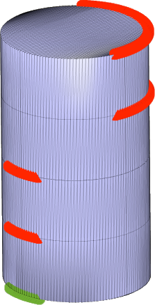
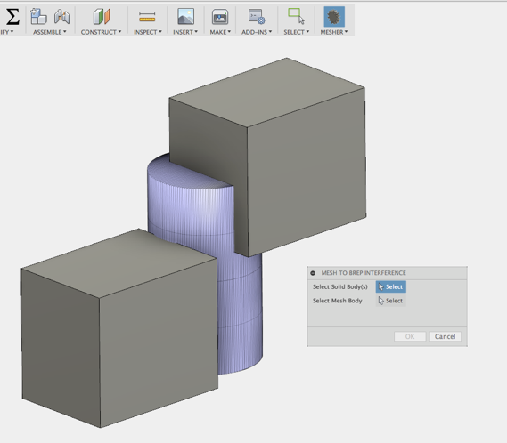
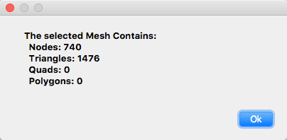

# FusionMesher
Mesh Utility for Fusion 360

# Installation
[Click here to download the Add-in](https://github.com/tapnair/FusionMesher/archive/master.zip)

After downloading the zip file follow the [installation instructions here](https://tapnair.github.io/installation.html) for your particular OS version of Fusion 360

# Usage

Select Mesher/Mesh to Brep Interference menu in the Solid Modeling Environment

Pick a mesh body and the solid bodies to check

After you are done with the results you can select: Mesher/Clear Results, to clear the graphics from the screen

Selecting Mesher/Mesh Info, to view stats about the mesh including node and polygon counts.

_Note: 'Polygons' in this dialog refers to objects with greater than 4 nodes._

## License
Samples are licensed under the terms of the [MIT License](http://opensource.org/licenses/MIT). Please see the [LICENSE](LICENSE) file for full details.

## Written by
Written by [Patrick Rainsberry](https://twitter.com/prrainsberry)   (Autodesk Fusion 360 Business Development)

See more useful [Fusion 360 Utilities](https://tapnair.github.io/index.html)

